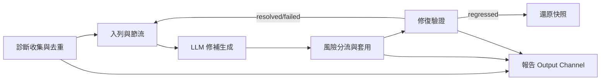

# Log Doctor

VSCode / Antigravity 擴充功能:手動命令掃描工作區 diagnostics,經 LLM 修復,低風險自動套用、高風險顯示 diff 由使用者確認。

`目標 (Goal):` 讓開發者用一條命令把工作區內 `vscode.languages.getDiagnostics()` 抓到的錯誤交給 LLM 修補,並依風險自動或人工確認地套用回原始檔。

---

## 業務領域 (Business Domains)

### 診斷收集與去重 (Diagnostic Collection & Dedup)

把 VSCode 內部 `vscode.Diagnostic` 物件轉成內部 `DiagnosticInfo`,依 source + 正規化訊息 + code 計算簽名,把根因相同的診斷合成一個代表項。目的:讓 LLM 一次只看一份根因樣本,避免重複打 API。

`領域流程 (Domain Flow):`

1. `extension.ts fixWorkspace` 觸發後,呼叫 `collectDiagnostics()` 走訪 `vscode.languages.getDiagnostics()` 的 map。
2. `collector.ts` 過濾掉 `source` 空白與 `severity === hint` 的項目,把 `DiagnosticSeverity` 對映到 `'error' | 'warning' | 'info'`,並從 `DiagnosticCode` 物件取出 `value`。
3. `dedup.ts groupBySignature()` 對每筆做 `signatureOf()` (sha1 雜湊 `source` + `normalizeMessage()` + `code`);`normalizeMessage()` 把識別字、路徑、行:列、十六進位、大數字替換成 token,讓同一類錯誤的雜訊被吸收。
4. 輸出 `RepresentativeDiagnostic[]`,每組保留首項為代表,其餘 URI 收集進 `groupUris`。

`核心實體 (Key Entities):` `DiagnosticInfo`, `RepresentativeDiagnostic`, `severity`/`source`/`code`/`range`

`相關處理器 (Related Handlers):` `collectDiagnostics()`, `signatureOf()`, `groupBySignature()`, `pickRepresentative()`, `normalizeMessage()`

---

### 入列與節流 (Queueing & Throttling)

把代表項入列為 `QueueItem`、以 `priority` 排序,並用全域冷卻 (`Scheduler`) 限制兩次實際套用之間的最小間隔,避免 LLM 修改太密集造成使用者來不及檢視。

`領域流程 (Domain Flow):`

1. `extension.ts fixWorkspace` 收到代表項後,呼叫 `grouper.ts sortAndCap()` 依 `severity` 優先 + 同嚴重度 `groupSize` 大者優先排序,裁切到 `cfg.maxIssues`。
2. 為每筆建立 `QueueItem` (id = `${source}::${uri}::${line}::${code}`),透過 `PersistentQueue.add()` 寫入 `workspaceState`,同名 id 不重複加入。
3. 啟動時 `Scheduler` 從 `workspaceState` 讀回上次 `lastAppliedAt`;每次 `processOneItem()` 先檢查 `scheduler.canRun()` 通過冷卻才往下跑。
4. 實際套用完成才呼叫 `scheduler.markApplied()` 推進時間戳;純失敗 (例如 LLM 沒回可解讀的 JSON) 不推進冷卻。

`核心實體 (Key Entities):` `QueueItem`, `QueueItemStatus` (`pending`/`in_flight`/`awaiting_confirmation`/`failed`/`resolved`), `Scheduler.lastAppliedAt`

`相關處理器 (Related Handlers):` `sortAndCap()`, `PersistentQueue.add/peek/update/clear`, `Scheduler.canRun/markApplied/msUntilNextRun`, `processOneItem()`

---

### LLM 修補生成 (LLM Fix Generation)

把代表項轉成 LLM 提示 (`system` + `user`),透過 `Provider` 介面送給 Claude 或 OpenAI,並把回傳文字解析成 `FixProposal[]`。每個 proposal 必須回填 `oldText`(檔內精確子串) + `newText`(替換內容) + `rationale`(理由)。

`領域流程 (Domain Flow):`

1. `fixer.ts fixOne()` 從 `QueueItem.diagnostic` 取出代表項,把 `file://` URI 轉回 fs path,讀入檔案內容。
2. `prompt.ts buildFixPrompt()` 從全文抽出診斷周圍 `contextLines` (預設 3) 行、組成 user message,並附上 system 規範 (JSON-only、`oldText` 必須 verbatim)。
3. `providers/factory.ts createProvider()` 依 `ConfigSnapshot.provider` 挑 `ClaudeProvider` 或 `OpenAIProvider`,由 `Provider.send()` 呼叫對應 SDK。
4. `providers/provider.ts sendForFixes()` 把 raw text 丟給 `parseFixResponse()` 解出 `fixes[]`;`fixer.ts` 過濾掉 `uri` 不等於代表項 URI 的雜訊,留下 `FixProposal[]`。

`核心實體 (Key Entities):` `PromptInput`, `BuiltPrompt` (`system`/`user`), `FixProposal` (`uri`/`oldText`/`newText`/`rationale`), `Provider`, `ConfigSnapshot`

`相關處理器 (Related Handlers):` `fixOne()`, `buildFixPrompt()`, `parseFixResponse()`, `createProvider()`, `ClaudeProvider.send()`, `OpenAIProvider.send()`, `sendForFixes()`

---

### 風險分流與套用 (Risk Classification & Application)

依 diagnostic source 與修補大小把每個 `FixProposal` 標記為 `low` 或 `high`,低風險直接 `WorkspaceEdit` 套到工作區,高風險彈出 diff 讓使用者決定;實際套用後再做回歸偵測,新冒出的同檔 error 自動還原。

`領域流程 (Domain Flow):`

1. `risk.ts decideRisk()` 同時檢查 `classifyBySource()` (source 命中 `autoApplySources` 才是 low) 與 `patchLineCount()` (`newText` 淨新增行數不超過 `autoApplyMaxLines`),任一不通過就升為 high。
2. `applier.ts applyOrConfirm()` 若風險 high 走 `showDiffAndAsk()` (目前用 `showInformationMessage` modal) 詢問 Apply/Reject;不論風險都呼叫 `buildWorkspaceEdit()` 定位 `oldText` 對應的 line/character,組出單一 `TextEdit`。
3. `extension.ts` 內的 `applyEdit()` 執行 `vscode.workspace.applyEdit()` 後 `saveAll(false)`,強制 LSP 重檢。
4. 只有 `applied === true` 才呼叫 `scheduler.markApplied()` 推進冷卻;若使用者拒絕,QueueItem 改為 `awaiting_confirmation`、嘗試次數加一。

`核心實體 (Key Entities):` `RiskLevel`, `WorkspaceEdit`, `vscode.Range`/`vscode.Position`/`vscode.Uri`

`相關處理器 (Related Handlers):` `classifyBySource()`, `patchLineCount()`, `decideRisk()`, `needsConfirmation()`, `buildWorkspaceEdit()`, `applyOrConfirm()`, `showDiff()`, `applyEdit()`

---

### 修復驗證 (Fix Verification)

套用修補並存檔後,等待 LSP 重檢時間 (預設 750ms debounce),重抓該檔 diagnostics,判定 `resolved` / `unresolved` / `regressed`,據此更新 QueueItem 狀態;`regressed` 會把檔案還原到套用前的快照。

`領域流程 (Domain Flow):`

1. `extension.ts processOneItem()` 在 `applyOrConfirm` 套用前先呼叫 `snapshotFile()` 讀取檔案全文備份,並抓一次 before diagnostics。
2. 套用後 `verifier.ts verifyFix()` 等 `debounceMs` 後呼叫 `fetchAfter()` 抓 after diagnostics。
3. `sameSignature()` 比對 uri + source + code + message;若 after 仍含相同代表項 → `unresolved`,after 含新冒出同檔 error → `regressed`,否則 → `resolved`。
4. `regressed` 時 `restoreFile()` 用備份還原並把 QueueItem 設為 `failed`;`resolved` 設為 `resolved`;`unresolved` 累計 attempts,到 `MAX_ATTEMPTS = 3` 才升為 `failed`。

`核心實體 (Key Entities):` `VerifyOutcome` (`resolved`/`unresolved`/`regressed`), `regressionCount`, `before`/`after` diagnostics 快照

`相關處理器 (Related Handlers):` `verifyFix()`, `sameSignature()`, `snapshotFile()`, `restoreFile()`, `collectDiagnostics()`

---

## 領域關聯 (Domain Relationships)



- `收集 → 入列:` 收集階段產出的 `RepresentativeDiagnostic` 是入列階段唯一的輸入;`severity` 與 `groupSize` 影響排序。
- `入列 → 生成 → 套用 → 驗證:` 一次 `processOneItem()` 走完後若 `applied` 才推進冷卻時間戳,失敗或拒絕時不消耗冷卻配額。
- `驗證 → 入列:` QueueItem 最終狀態 (`resolved` / `failed`) 由 `verifier` 決定,後續可由使用者重觸命令再掃一輪。
- `設定 → 全部:` `ConfigSnapshot` (`provider` / `model` / `autoApplySources` / `autoApplyMaxLines` / `maxIssues` / `cooldownMinutes`) 與 `SecretStorage` 內的 API key 是所有階段共用輸入。

---

## 使用方式 (Usage)

### 安裝與建置

```bash
npm install
npm run build
```

### 啟動

1. VSCode 中按 F5 開 Extension Development Host。
2. 設定 `logDoctor.provider` 為 `claude` 或 `openai`;設定 `logDoctor.model` 為模型 ID (預設 `claude-sonnet-4-6`)。
3. 命令面板 → `Log Doctor: Set API Key` 輸入金鑰;會依 provider 寫入 SecretStorage (`logDoctor.apiKey.claude` / `logDoctor.apiKey.openai`)。
4. 命令面板 → `Log Doctor: Fix Workspace Issues` 觸發一輪掃描 + 修補。

### 設定

| 設定 | 預設 | 說明 |
|------|------|------|
| `logDoctor.provider` | `claude` | `claude` 或 `openai` |
| `logDoctor.model` | `claude-sonnet-4-6` | 模型 ID |
| `logDoctor.autoApplySources` | `["eslint","prettier","ruff","gofmt","stylelint"]` | 低風險來源 (不分大小寫) |
| `logDoctor.autoApplyMaxLines` | `3` | 低風險修補淨新增行數上限 |
| `logDoctor.maxIssues` | `50` | 單次入列代表項上限 |
| `logDoctor.cooldownMinutes` | `30` | 兩次實際套用最短間隔 (分鐘) |

### 測試

```bash
npm test
```

整合測試需先 `npm run build` 再以 `@vscode/test-electron` 跑(後續補上)。

---

## 改善建議 (Improvement Suggestions)

- [ ] 整合測試缺口:目前只有 Vitest 單元測試,沒有走 `extension.ts` 啟動 → 觸發命令 → 套用 → 驗證的整合測試;`@vscode/test-electron` 已列為 devDependency 但無腳本,補上後能確保 wire-up 不會壞。
- [ ] `showDiffAndAsk` 改為 `vscode.diff`:目前用 `showInformationMessage` 顯示一段文字,使用者看不到真實差異;改用 `vscode.diff` 命令開虛擬檔 diff 編輯器能讓人工確認更可靠。
- [ ] 重試策略太粗:`MAX_ATTEMPTS = 3` 對 `unresolved` 與 `no usable fix` 走同樣計數,且未區分 LLM 錯誤型態 (rate limit vs. JSON 解析失敗);可拆出 `requeue` 與 `fail`,並在 rate limit 時退避重試。
- [ ] 設定變更監聽未啟用:`loadConfig()` 每次都重抓一次,若使用者在 VSCode 設定頁改了 `provider` 或 `model`,需要重啟命令才生效;可加 `onDidChangeConfiguration` 監聽並 reload。
- [ ] 風險規則不夠細:目前 `decideRisk` 只看 source 與行數,沒有看修補是否觸及 `import`/`export`/`delete` 等高風險語法;可加 pattern 黑名單 (例如 `newText.match(/\bimport\s/)` 直接升 high)。
- [ ] QueueItem 過期清理:`PersistentQueue` 從不清理 `failed` 或 `resolved` 項目,長期使用後 `workspaceState` 會累積大量歷史;可加 retention 政策 (N 天後清掉) 或 status filter API。
- [ ] 觀察性不足:全部狀態都走 Output channel,沒有結構化紀錄或 metrics;若日後要做 dashboard 或 rate-limit 報表,需補一層結構化 log (JSON line) 與計數。
